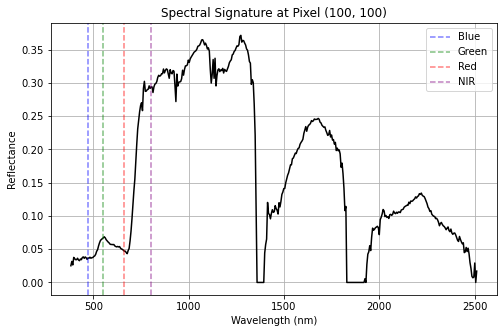

# Hyperspectral Image Processing – NEON Data

This project demonstrates how to process hyperspectral remote sensing data from NEON (National Ecological Observatory Network) and generate:

* **True Color Composite (RGB)**
* **False Color Composite (FCC – NIR, Red, Green)**

---

## 📂 Dataset

The dataset used is a NEON hyperspectral reflectance product:

* File: `NEON_D12_YELL_DP3_537000_4976000_reflectance.h5`
* Site: YELL (Yellowstone)
* Format: HDF5

---

## ⚙️ Workflow

### Load Hyperspectral Data

* Read `.h5` file using `h5py`
* Extract:

  * Reflectance cube
  * Wavelength information

#### 📈 Spectral Signature Curve
Extract reflectance values across all wavelengths for a selected pixel
Plot reflectance vs wavelength

This helps in identifying material characteristics such as vegetation, soil, and water.

---

## 🖼️ Outputs

### True Color Composite (RGB)

---

### False Color Composite (FCC)

### Spectral Signature Curve

