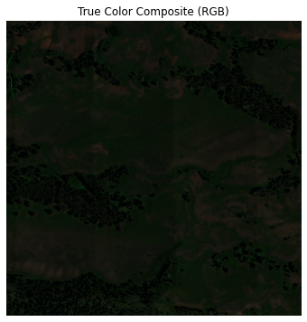
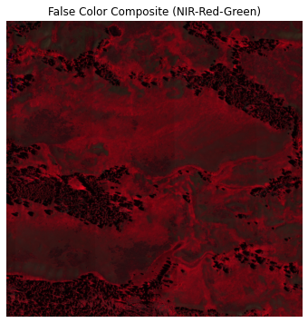

# Hyperspectral Image Processing – NEON Data

This project demonstrates how to process hyperspectral remote sensing data from NEON (National Ecological Observatory Network) and generate:

* **True Color Composite (RGB)**
* **False Color Composite (FCC – NIR, Red, Green)**

---

## 📂 Dataset

The dataset used is a NEON hyperspectral reflectance product:

* File: `NEON_D12_YELL_DP3_537000_4976000_reflectance.h5`
* Site: YELL (Yellowstone)
* Format: HDF5

---

## ⚙️ Workflow

### 1. Load Hyperspectral Data

* Read `.h5` file using `h5py`
* Extract:

  * Reflectance cube
  * Wavelength information

### 2. Preprocessing

* Apply scale factor (`/ 10000`) to convert reflectance values

### 3. Band Selection

Specific wavelength bands are selected:

| Band  | Wavelength (nm) | Use       |
| ----- | --------------- | --------- |
| Blue  | ~470 nm         | RGB       |
| Green | ~550 nm         | RGB / FCC |
| Red   | ~660 nm         | RGB / FCC |
| NIR   | ~800 nm         | FCC       |

### 4. Image Composites

#### 🌈 True Color Composite (RGB)

* Red → 660 nm
* Green → 550 nm
* Blue → 470 nm

#### 🌿 False Color Composite (FCC)

* Red channel → NIR (~800 nm)
* Green channel → Red (~660 nm)
* Blue channel → Green (~550 nm)

---

## 🖼️ Outputs

### True Color Composite (RGB)

---

### False Color Composite (FCC)

