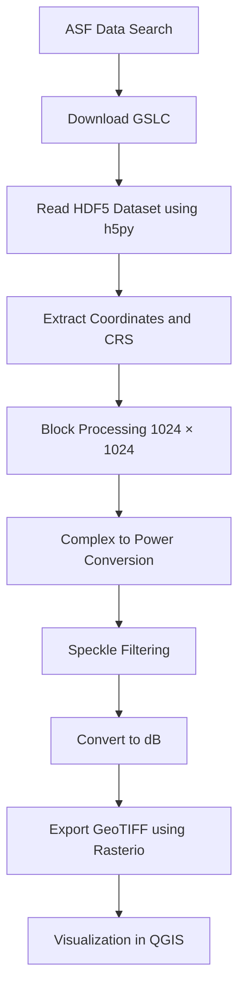

## **NISAR GSLC Data Processing using Python**

This repository contains a Python script to preprocess NISAR GSLC (Geocoded Single Look Complex) SAR data and convert it into a georeferenced GeoTIFF suitable for GIS analysis.

The workflow reads the GSLC .h5 dataset, performs radiometric conversion and speckle filtering, and exports the processed raster while preserving spatial reference.

## **About NISAR**

The NISAR is a joint Earth observation satellite mission developed by NASA and ISRO.

Key mission characteristics:
| Parameter | Description |
|-----------|-------------|
| Orbit altitude | 747 km |
| Orbit inclination | 98° |
| Repeat cycle | 12 days |
| Radar bands | L-band (NASA) and S-band (ISRO) |
| Swath width | >240 km |

The GSLC product is a Level-2 geocoded dataset.

  **Data Source:** Alaska Satellite Facility Data Search (https://search.asf.alaska.edu/#/?dataset=NISAR&prodConfig=PR)

## **Processing Workflow**

## **Output**
The  Processed output provides a high-resolution backscatter image, with values typically ranging from -0.12 dB to -31.78 dB for HH-polarization in the sample dataset.

## **Author**
**N. Ravichandra**
[M.Tech – Geoinformatics / Remote Sensing]
