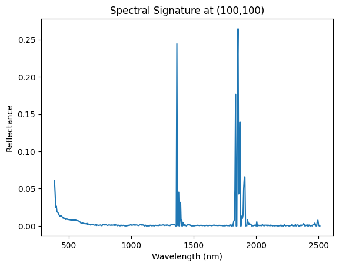
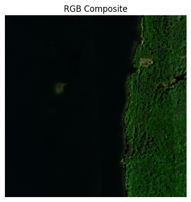
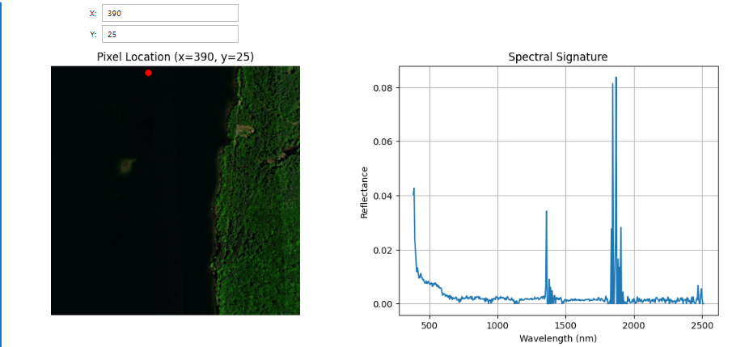

```python
import h5py

file_path = r"G:\2809\Desktop filess\Assignments\Sem-2\TMHRS\Hyperspectral\NEON_refl-surf-dir-ortho-mosaic\NEON.D01.HARV.DP3.30006.001.2014-06.basic.20260422T135545Z.RELEASE-2026\NEON_D01_HARV_DP3_723000_4706000_reflectance.h5"

with h5py.File(file_path, 'r') as f:
    def print_structure(name, obj):
        print(name)
    f.visititems(print_structure)
```

    HARV
    HARV/Reflectance
    HARV/Reflectance/Metadata
    HARV/Reflectance/Metadata/Ancillary_Imagery
    HARV/Reflectance/Metadata/Ancillary_Imagery/Aerosol_Optical_Depth
    HARV/Reflectance/Metadata/Ancillary_Imagery/Aspect
    HARV/Reflectance/Metadata/Ancillary_Imagery/Cast_Shadow
    HARV/Reflectance/Metadata/Ancillary_Imagery/Dark_Dense_Vegetation_Classification
    HARV/Reflectance/Metadata/Ancillary_Imagery/Data_Selection_Index
    HARV/Reflectance/Metadata/Ancillary_Imagery/Haze_Cloud_Water_Map
    HARV/Reflectance/Metadata/Ancillary_Imagery/Illumination_Factor
    HARV/Reflectance/Metadata/Ancillary_Imagery/Path_Length
    HARV/Reflectance/Metadata/Ancillary_Imagery/Sky_View_Factor
    HARV/Reflectance/Metadata/Ancillary_Imagery/Slope
    HARV/Reflectance/Metadata/Ancillary_Imagery/Smooth_Surface_Elevation
    HARV/Reflectance/Metadata/Ancillary_Imagery/Visibility_Index_Map
    HARV/Reflectance/Metadata/Ancillary_Imagery/Water_Vapor_Column
    HARV/Reflectance/Metadata/Ancillary_Imagery/Weather_Quality_Indicator
    HARV/Reflectance/Metadata/Coordinate_System
    HARV/Reflectance/Metadata/Coordinate_System/Coordinate_System_String
    HARV/Reflectance/Metadata/Coordinate_System/EPSG Code
    HARV/Reflectance/Metadata/Coordinate_System/Map_Info
    HARV/Reflectance/Metadata/Coordinate_System/Proj4
    HARV/Reflectance/Metadata/Flight_Trajectory
    HARV/Reflectance/Metadata/Logs
    HARV/Reflectance/Metadata/Logs/140137
    HARV/Reflectance/Metadata/Logs/140137/ATCOR_Input_file
    HARV/Reflectance/Metadata/Logs/140137/ATCOR_Processing_Log
    HARV/Reflectance/Metadata/Logs/140137/Shadow_Processing_Log
    HARV/Reflectance/Metadata/Logs/140137/Skyview_Processing_Log
    HARV/Reflectance/Metadata/Logs/140137/Solar_Azimuth_Angle
    HARV/Reflectance/Metadata/Logs/140137/Solar_Zenith_Angle
    HARV/Reflectance/Metadata/Logs/141233
    HARV/Reflectance/Metadata/Logs/141233/ATCOR_Input_file
    HARV/Reflectance/Metadata/Logs/141233/ATCOR_Processing_Log
    HARV/Reflectance/Metadata/Logs/141233/Shadow_Processing_Log
    HARV/Reflectance/Metadata/Logs/141233/Skyview_Processing_Log
    HARV/Reflectance/Metadata/Logs/141233/Solar_Azimuth_Angle
    HARV/Reflectance/Metadata/Logs/141233/Solar_Zenith_Angle
    HARV/Reflectance/Metadata/Logs/142352
    HARV/Reflectance/Metadata/Logs/142352/ATCOR_Input_file
    HARV/Reflectance/Metadata/Logs/142352/ATCOR_Processing_Log
    HARV/Reflectance/Metadata/Logs/142352/Shadow_Processing_Log
    HARV/Reflectance/Metadata/Logs/142352/Skyview_Processing_Log
    HARV/Reflectance/Metadata/Logs/142352/Solar_Azimuth_Angle
    HARV/Reflectance/Metadata/Logs/142352/Solar_Zenith_Angle
    HARV/Reflectance/Metadata/Logs/143523
    HARV/Reflectance/Metadata/Logs/143523/ATCOR_Input_file
    HARV/Reflectance/Metadata/Logs/143523/ATCOR_Processing_Log
    HARV/Reflectance/Metadata/Logs/143523/Shadow_Processing_Log
    HARV/Reflectance/Metadata/Logs/143523/Skyview_Processing_Log
    HARV/Reflectance/Metadata/Logs/143523/Solar_Azimuth_Angle
    HARV/Reflectance/Metadata/Logs/143523/Solar_Zenith_Angle
    HARV/Reflectance/Metadata/Spectral_Data
    HARV/Reflectance/Metadata/Spectral_Data/FWHM
    HARV/Reflectance/Metadata/Spectral_Data/Wavelength
    HARV/Reflectance/Metadata/to-sensor_azimuth_angle
    HARV/Reflectance/Metadata/to-sensor_zenith_angle
    HARV/Reflectance/Reflectance_Data
    


```python
import numpy as np

with h5py.File(file_path, 'r') as f:
    refl = f['HARV/Reflectance/Reflectance_Data'][:]
    wavelengths = f['HARV/Reflectance/Metadata/Spectral_Data/Wavelength'][:]
```


```python
scale_factor = 10000.0
refl = refl / scale_factor
```


```python
import matplotlib.pyplot as plt

pixel_x = 100
pixel_y = 100

spectrum = refl[pixel_y, pixel_x, :]

plt.plot(wavelengths, spectrum)
plt.xlabel("Wavelength (nm)")
plt.ylabel("Reflectance")
plt.title(f"Spectral Signature at ({pixel_x},{pixel_y})")
plt.show()
```


    

    


```python

from ipywidgets import interact, IntText

interact(
    interactive_spectra_plot,
    x=IntText(value=100, description='X:'),
    y=IntText(value=100, description='Y:')
)
```


    interactive(children=(IntText(value=100, description='X:'), IntText(value=100, description='Y:'), Output()), _…


    <function __main__.interactive_spectra_plot(x, y)>


```python
def find_band(target):
    return np.argmin(np.abs(wavelengths - target))

r = refl[:, :, find_band(660)]
g = refl[:, :, find_band(550)]
b = refl[:, :, find_band(470)]

rgb = np.stack([r, g, b], axis=2)

# Normalize
rgb = (rgb - np.min(rgb)) / (np.max(rgb) - np.min(rgb))

plt.imshow(rgb)
plt.title("RGB Composite")
plt.axis('off')
plt.show()
```


    

    


```python
import matplotlib.pyplot as plt
from ipywidgets import interact_manual, BoundedIntText

def show_pixel_spectrum(x, y):
    fig, ax = plt.subplots(1, 2, figsize=(14, 5))
    
    # LEFT: Image with selected pixel
    ax[0].imshow(rgb)
    ax[0].scatter(x, y, color='red', s=40)
    ax[0].set_title(f"Pixel Location (x={x}, y={y})")
    ax[0].axis('off')
    
    # RIGHT: Spectral signature
    spectrum = refl[y, x, :]
    ax[1].plot(wavelengths, spectrum)
    ax[1].set_xlabel("Wavelength (nm)")
    ax[1].set_ylabel("Reflectance")
    ax[1].set_title("Spectral Signature")
    ax[1].grid()
    
    plt.show()
from ipywidgets import interact, BoundedIntText

interact(
    show_pixel_spectrum,
    x=BoundedIntText(value=100, min=0, max=refl.shape[1]-1, description='X:'),
    y=BoundedIntText(value=100, min=0, max=refl.shape[0]-1, description='Y:')
)
```


    interactive(children=(BoundedIntText(value=100, description='X:', max=999), BoundedIntText(value=100, descript…


    



    <function __main__.show_pixel_spectrum(x, y)>


```python

```
